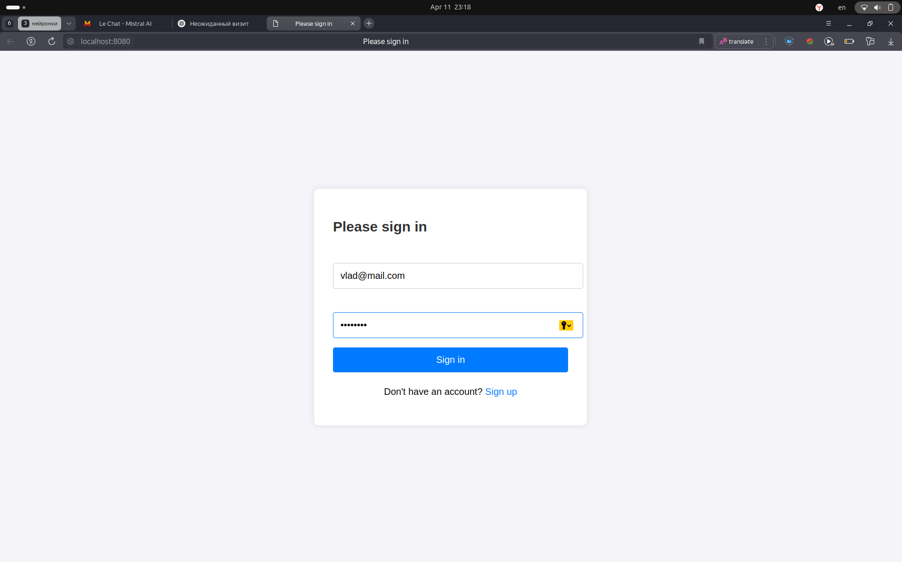
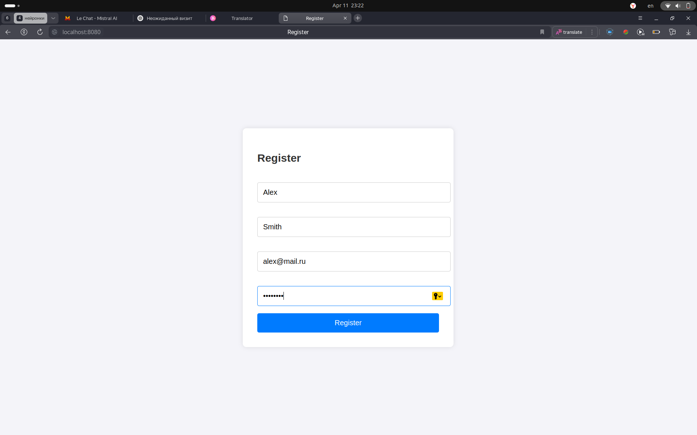
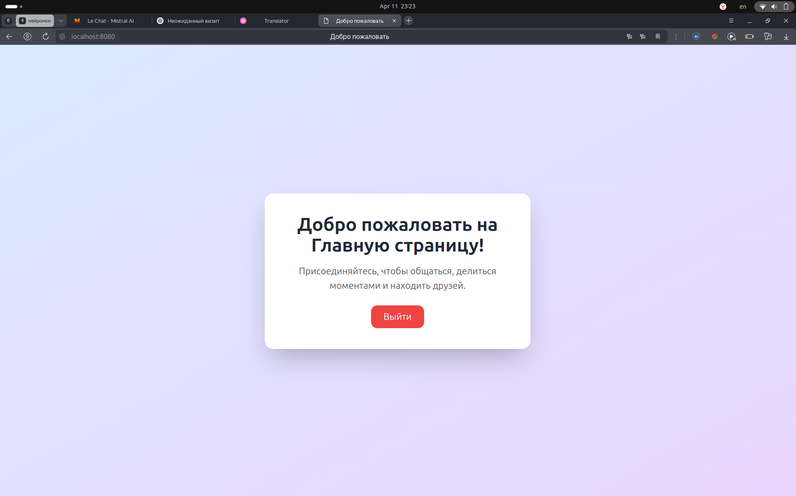

# 🌐 Регистрация и Авторизация с Spring Security

Простое веб-приложение на Spring Boot, реализующее регистрацию и авторизацию пользователей через **сессии** с использованием **Spring Security**.

## 📦 Стек технологий

- Java 23
- Spring Boot 3
- Spring Security
- Thymeleaf
- Maven
- HTML + Tailwind CSS (для стилей)

---

## 🚀 Возможности

- 📋 Регистрация нового пользователя
- 🔐 Авторизация через форму входа
- ✅ Валидация данных при регистрации
- 📄 Кастомные страницы входа, регистрации и приветствия
- 🚪 Выход из системы через кнопку (с завершением сессии)
- ⚠️ Глобальная обработка ошибок валидации
- 🛡 Без использования токенов или JWT (только сессии)

---

## 📁 Структура проекта

.
├── config/ # Конфигурация безопасности
├── controllers/ # Контроллеры для логики входа, регистрации, домашней страницы
├── dto/ # DTO-объекты
├── exception/ # Глобальный обработчик ошибок
├── model/ # Сущность User
├── repository/ # Spring Data репозиторий
├── services/ # Бизнес-логика авторизации и регистрации
├── resources/
│   ├── templates/ # Шаблоны Thymeleaf (login, register, hello)
│   └── static/css/ # Стили CSS
└── SocialNetworkApplication.java

## ⚙️ Настройка и запуск

1. **Склонируй репозиторий**:
   ```bash
   git clone https://github.com/yourusername/social-network.git
   cd social-network
   
2. Собери и запусти приложение:
    ``` bash
    ./mvnw spring-boot:run
    ```

3. Открой в браузере:

    ```bash
    http://localhost:8080/login
    ```

## 🔑 Доступ
### 📄 Регистрация
Открой /register и создай нового пользователя. После успешной регистрации будет доступна авторизация.

## 🔐 Авторизация
Вход через /login. 
После входа пользователь будет перенаправлен на страницу приветствия /hello.

## 📸 Скриншоты

| Страница входа                                                 | Страница регистрации                                      | Приветствие                                           |
|----------------------------------------------------------------|-----------------------------------------------------------|-------------------------------------------------------|
|  |  |  |

